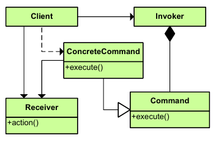

|**Pattern:** Command|
|:---|
|**Type:** Behavioral|
|**What it is:** Encapsulate a request as an object, thereby letting you parameterize clients with different requests, queue or log requests, and support undoable operations.|