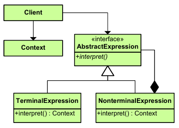

|**Pattern:** Interpreter|
|:---|
|**Type:** Behavioral|
|**What it is:** Given a language, define a representation for its grammar along with an interpreter that uses the representation to interpret sentences in the language.|