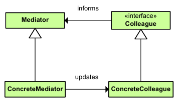

|**Pattern:** Mediator|
|:---|
|**Type:** Behavioral|
|**What it is:** Define an object that encapsulates how a set of objects interact. Promotes loose coupling by keeping objects from referring to each other explicitly and it lets you vary their interactions independently.|