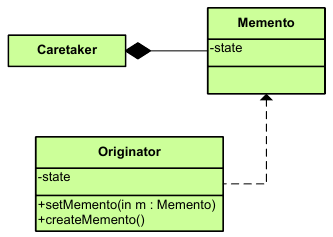

|**Pattern:** Memento|
|:---|
|**Type:** Behavioral|
|**What it is:** Without violating encapsulation, capture and externalize an object's internal state so that the object can be restored to this state later.|