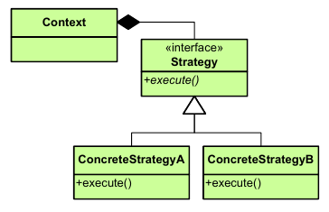

|**Pattern:** Strategy|
|:---|
|**Type:** Behavioral|
|**What it is:** Define a family of algorithms, encapsulate each one, and make them interchangeable. Lets the algorithm vary independently from clients that use it.|