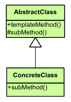

|**Pattern:** Template method|
|:---|
|**Type:** Behavioral|
|**What it is:** Define the skeleton of an algorithm in an operation, deferring some steps to subclasses. Lets subclasses redefine certain steps of an algorithm without changing the algorithm's structure.|