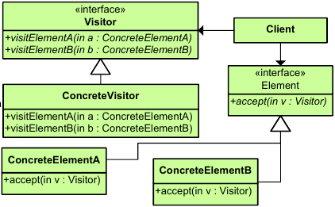

|**Pattern:** Visitor|
|:---|
|**Type:** Behavioral|
|**What it is:** Represent an operation to be performed on the elements of an object structure. Lets you define a new operation without changing the classes of the elements on which it operates|