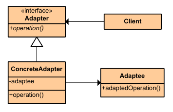

|**Pattern:** Adapter|
|:---|
|**Type:** Structural|
|**What it is:** Convert the interface of a class into another interface clients expect. Lets classes work together that couldn't otherwise because of incompatible interfaces.|