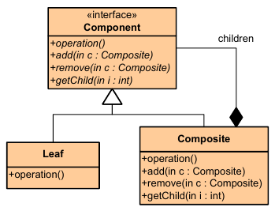

|**Pattern:** Composite|
|:---|
|**Type:** Structural|
|**What it is:** Compose objects into tree structures to represent part-whole hierarchies. Lets clients treat individual objects and compositions of objects uniformly.|