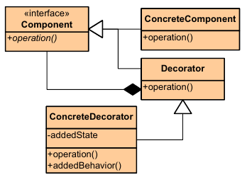

|**Pattern:** Decorator|
|:---|
|**Type:** Structural|
|**What it is:** Attach additional responsibilities to an object dynamically. Provide a flexible alternative to sub-classing for extending functionality.|