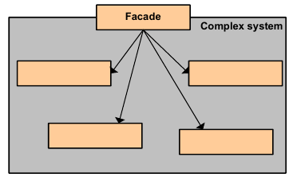

|**Pattern:** Facade|
|:---|
|**Type:** Structural|
|**What it is:** Provide a unified interface to a set of interfaces in a subsystem. Defines a high-level interface that makes the subsystem easier to use.|