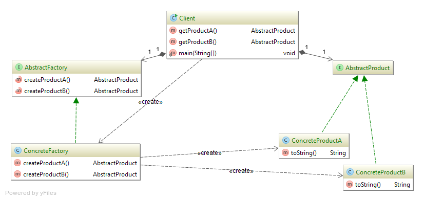

**Class diagram (pattern "Abstract Factory"):**

---

**AbstractProduct** — product interface.

**ConcreteProductA, ConcreteProductB** — concrete products.
Implement interface AbstractProduct;

**AbstractFactory** — factory interface.
Defines interface for objects to be created by abstract methods.

**ConcreteFactory** — concrete factory.
Implement interface AbstractFactory with methods for creating objects ConcreteProductA and ConcreteProductB.

**Client** — main client that uses AbstractFactory for creating products.