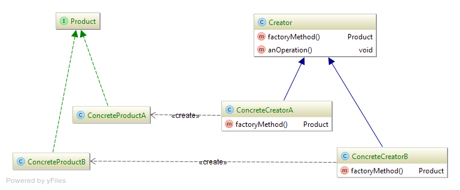

**Class diagram (pattern "Factory Method"):**

---

**Product** — product interface.
Defines interface for objects to be created by abstract method.

**ConcreteProductA, ConcreteProductB** — concrete products.
Implement interface Product;

**Creator** — abstract creator.
Defines a factory method, that returns object of type Product. 
Can also have a default implementation of this method.
Can call factory method for creating object of type Product;

**ConcreteCreatorA, ConcreteCreatorB** — concrete creators.
Override factory method to create and return objects of type ConcreteProductA, ConcreteProductB.