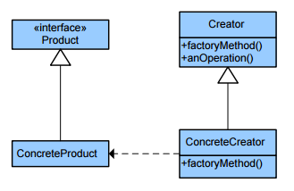

|**Pattern:** Factory method|
|:---|
|**Type:** Creational|
|**What it is:** Define an interface for creating an object, but let subclasses decide which class to instantiate. Lets a class defer instantiation to subclasses.|

|**Шаблон:** Фабричный метод|
|:---|
|**Тип:** Порождающий|
|**Что это:** Определяет интерфейс для создания объекта, но позволяет подклассам решать, какой класс инстанцировать. Позволяет делегировать создание объекта подклассам.|